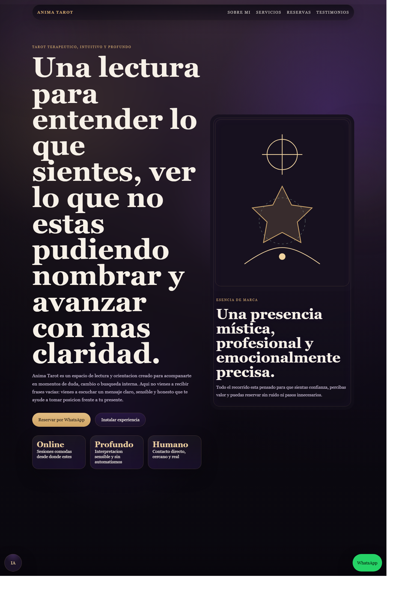
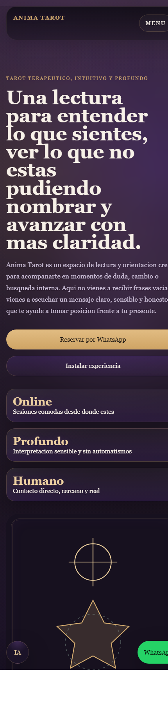

# Anima Tarot

Sitio web estatico para Anima Tarot, diseñado para presentar servicios de lectura, resolver dudas frecuentes y convertir visitas en solicitudes directas por WhatsApp.

## Estado actual

La version publicada incluye:

- propuesta de valor y hero principal orientado a conversion
- tres servicios cerrados con enfoque comercial claro
- modal de reserva por servicio
- envio de solicitud a WhatsApp con mensaje precargado
- persistencia local de datos del usuario en el modal mediante localStorage
- chatbot flotante con FAQ y memoria conversacional basica
- soporte PWA con manifest y service worker

## Capturas

Vista de escritorio:

Vista mobile:

## Stack

- HTML
- CSS
- JavaScript
- manifest web app
- service worker

## Estructura del proyecto

- [index.html](index.html): estructura principal del sitio, contenido y modal de reserva
- [css/styles.css](css/styles.css): sistema visual, responsive, componentes y estilos del modal
- [js/app.js](js/app.js): menu mobile, logica del modal y envio a WhatsApp
- [js/chatbot.js](js/chatbot.js): chatbot, FAQ y memoria contextual
- [js/form.js](js/form.js): mensaje de continuidad para el formulario legacy
- [js/pwa.js](js/pwa.js): instalacion PWA y registro del service worker
- [service-worker.js](service-worker.js): cache offline y actualizacion de assets
- [manifest.webmanifest](manifest.webmanifest): configuracion instalable de la app
- [images/icon-app.svg](images/icon-app.svg): icono principal de la PWA

## Flujo de conversion

1. La persona entra al sitio y ve la propuesta de valor principal.
2. Explora los servicios y elige uno desde las tarjetas comerciales.
3. Abre el modal de reserva del servicio seleccionado.
4. Completa sus datos una sola vez.
5. El sitio recuerda nombre, apellido, fecha de nacimiento, email y notas para futuras reservas.
6. Al enviar, se abre WhatsApp con la solicitud ya armada.

## Servicios actuales

Los servicios y sus textos comerciales viven en [index.html](index.html).

Cada servicio puede definir:

- nombre
- resumen breve
- beneficios o enfoque
- llamada a la accion
- texto que se envia al modal

## WhatsApp

El sitio usa el numero configurado en [js/app.js](js/app.js) para construir el mensaje final de reserva.

El mensaje enviado incluye:

- servicio elegido
- detalle o resumen del servicio
- nombre
- apellido
- fecha de nacimiento
- email
- notas opcionales

## Persistencia local

El modal guarda datos del usuario en localStorage para evitar que tenga que reescribirlos en cada nueva reserva.

Actualmente se persisten estos campos desde [js/app.js](js/app.js):

- nombre
- apellido
- fechaNacimiento
- email
- notas

## Chatbot

El chatbot esta implementado en [js/chatbot.js](js/chatbot.js).

Incluye:

- preguntas frecuentes tactiles
- deteccion de temas por palabras clave
- continuidad de respuesta cuando la persona hace preguntas de seguimiento
- memoria simple guardada en localStorage

## PWA

La instalacion y el cache estan resueltos con:

- [manifest.webmanifest](manifest.webmanifest)
- [js/pwa.js](js/pwa.js)
- [service-worker.js](service-worker.js)

Cuando se actualizan archivos importantes del frontend, conviene incrementar la version del cache en [service-worker.js](service-worker.js) para evitar que clientes con una version anterior sigan viendo assets viejos.

## Publicacion

Repositorio:

- https://github.com/braianruaimi/Anima-Tarot

Sitio esperado en GitHub Pages:

- https://braianruaimi.github.io/Anima-Tarot/

Para publicar desde GitHub Pages:

1. Ir a Settings > Pages.
2. Elegir Deploy from a branch.
3. Seleccionar la rama main.
4. Seleccionar la carpeta /root.
5. Guardar los cambios.

## Desarrollo local

No requiere dependencias ni proceso de build.

Opciones simples para probarlo:

1. Abrir [index.html](index.html) en el navegador.
2. Servir la carpeta con una extension de live server.
3. Usar cualquier servidor estatico simple.

## Personalizacion rapida

Para cambiar contenido:

- editar [index.html](index.html)

Para cambiar visual:

- editar [css/styles.css](css/styles.css)

Para cambiar el flujo del modal o el numero de WhatsApp:

- editar [js/app.js](js/app.js)

Para ajustar respuestas del asistente:

- editar [js/chatbot.js](js/chatbot.js)

## Notas de mantenimiento

- Si cambias textos, servicios o assets criticos, revisa si hace falta subir la version del cache en [service-worker.js](service-worker.js).
- Si el sitio parece no actualizar en un dispositivo ya instalado, suele ser un tema de cache del service worker.
- El formulario legacy del bloque de contacto ya no procesa reservas: el flujo principal ahora vive en el modal de cada servicio.

## Resumen

Anima Tarot queda documentado como un sitio estatico, comercial y listo para operar, con reserva directa por WhatsApp, memoria local para mejorar la friccion del formulario y base PWA para instalacion.